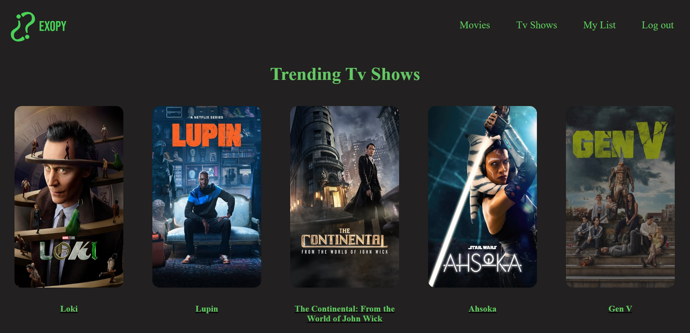
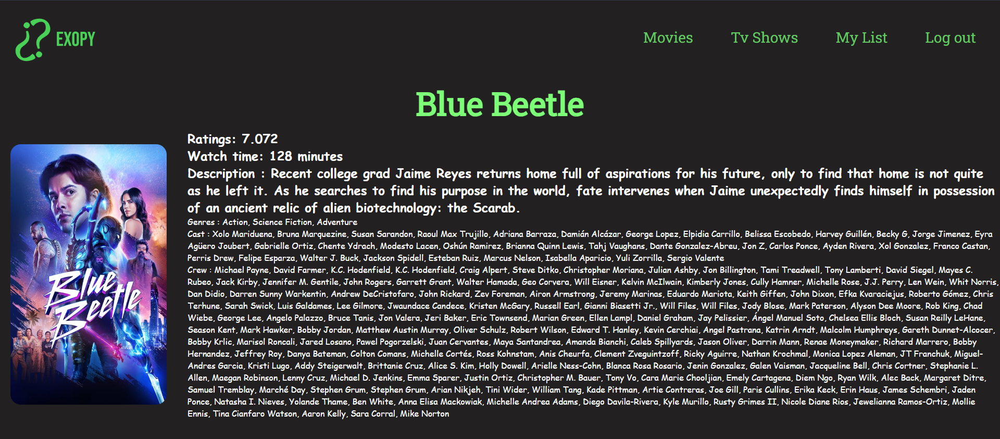

# EXOPY

This is an EXOPY platform that utilizes the TMDB API for movie data and applies a custom design. The platform is built using Django, a high-level Python web framework.

## Project Status

**Last Updated: July 9, 2023**
#
### status : Incomlete 
* authentication ['completed']  
* home page  ['completed']
* series page ['completed']
* trending ['completed']
* genre ['progressing']
* my list ['incomplete']
* user feedback sent to dev['incompplete']
* deploy movie recommendation system ['pending']
#
The project is currently under active development. New features and improvements are being added regularly. If you want to contribute to project exopy just send PR with your updates, I would gladly accept it .Please refer to the changelog below for the latest updates.

## Some ScreenShots:






## Features

- User authentication and registration
- Browse and search movies from the TMDB database
- Movie details page with synopsis, ratings, and cast information
- Create and manage watchlists
- Review and rate movies
- Customizable user profiles
- Responsive design for different devices
- Admin panel for managing movies and user accounts

## Installation

1. Clone the repository:
```
#git clone https://github.com/your-username/exopy.git
```
3. Change into the project directory:
```
cd exopy
```
4. Create a virtual environment:
```
  python3 -m venv myenv
```

4. Activate the virtual environment:
```
source myenv/bin/activate
```
5. Install the required dependencies:
```
pip install -r requirements.txt
```

6. Set up the database:
```
   python manage.py migrate
```


7. Obtain an API key from [TMDB](https://www.themoviedb.org/) and update the `settings.py` file with your API key:

```
python TMDB_API_KEY = 'your-api-key'

```

8. Run the development server:

```
   python manage.py runserver
```
# Open your web browser and visit http://localhost:8000 to access the EXOPY platform.
